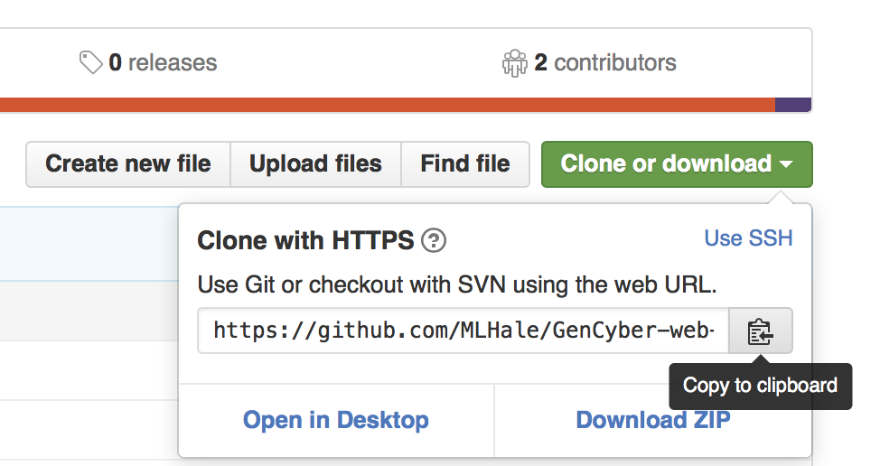

## Github Primer

Git is a popular developer tool for collaboration and version control. It is not limited to just code. You may use it for collaborative development of any written work. Github is a popular online platform to host public git repositories. There are several other services like Github, such as [BitBucket](https://bitbucket.org/). For our lessons we will stick to Github for now.  Working through the tutorials below, git's use for collaboration and version control will become clear.

### Table of Contents    
[Step 1: Create Account](#step-1)  
[Step 2: Hello World](#step-2)  
[Step 3: Clone Repository](#step-3)  
[Step 4: Push Changes](#step-4)  
[Step 5: Pull Remote Changes](#step-5)  
[Step 6: Fork Repository](#step-6)  
[Step 7: Pull Request](#step-7)  
[Step 8: Markdown](#step-8)  


### Step 1
First things first, create a free account on Github. https://github.com/join

### Step 2
Complete the Github tutorial.
https://guides.github.com/activities/hello-world/

At the end of Step 2, you have created a **Remote** repository. It is "remote" because all your files are in the Github cloud. How do you continue to work on your repository if you had no Internet connection? Also, it is not convenient to write and test code online. It would be great to your own **Local** repository. We will do just that in the next step.

### Step 3
To create a **Local** repository there are two basic options.
1. Clone a remote repository on your computer, or
2. Initialize a new git repository from scratch on your computer

##### Clone a remote repository
Let's go with option #1. Git tools do not come pre-installed. To check if they exist on your operating system, open up a command line interface and type `git`. If git is installed, this command will give you some help options. If the command is not recognized, then use this link to install git for your operating system flavor. https://git-scm.com/book/en/v2/Getting-Started-Installing-Git

For a Ubuntu OS, here are the instructions:

```bash
sudo apt-get update
sudo apt-get -y install git
```
The `-y` option automates the installation by responding YES to any prompts. After the installation succeeds, type `git` to see various command options. To clone a remote repository, we first need a reference to it. On Github.com, navigate to your hello-world repository and click on the button that says `Clone`. Copy that URL.



Now we are ready to clone this remote repository, and create a local repository. To do this we will use the `git clone <repository URL>` command. In the command below replace the URL with the URL of the repository that you want to clone.

```bash
git clone https://github.com/robinagandhi/hello-world.git
```
The command may prompt for your Github username and password. You will start to see some download messages and upon success, your local repository will be ready for use. You may navigate to the corresponding file folder and confirm if all the files are there.

```bash
$ cd hello-world
$ ls
LICENSE		README.md
```

### Step 4
Make local changes and push changes back to remote repository.

### Step 5
Make remote changes and pull changes to local repository.

### Step 6
Forking a repository.

### Step 7
Make changes to your peers' repository create a pull request.

### Step 8
Learn Markdown and Github Flavor Variants. https://help.github.com/categories/writing-on-github/
