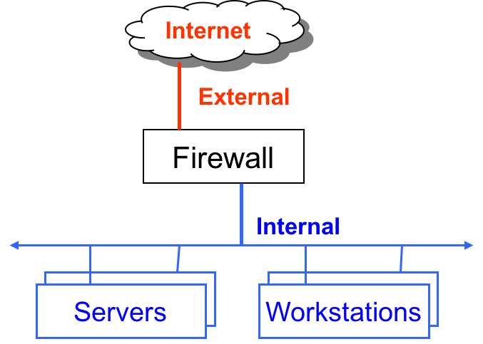

# Day 2: Firewalls

Firewalls are often are a first line of defense for a enterprise or home network. In this unit we will understand the fundamentals of firewalls, write firewall rules that configure its behavior and then test if the firewall performs as expected.

## Overview

The name firewall is inspired from its physical manifestation in construction which refers to walls that are designed to stop a fire from spreading.

 

While these are "cool", we are interesting in a different kind of firewall. The ones that protect internal networks from external networks. These kinds of firewalls allow us to control the flow of information across networks. 

All popular operating systems now come with a firewall installed. For server installations we will focus on the Netfilter firewall built into the linux kernel itself. This firewall is configured using the `iptables` command.

