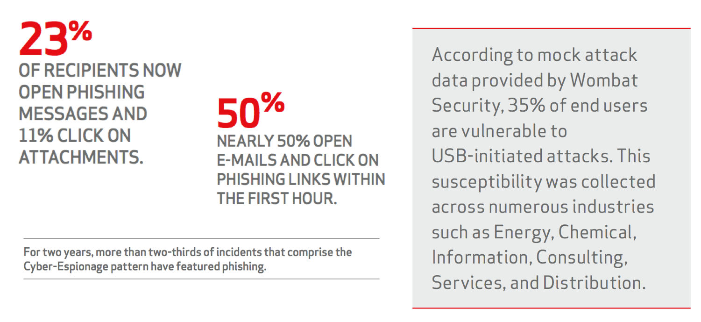
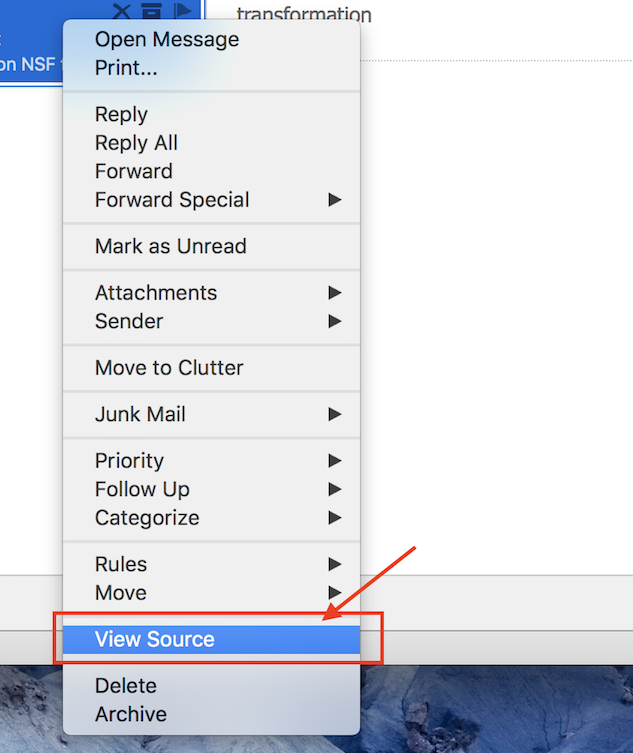

# Email Header Analysis

## Introduction (5 Mins)

Email is an indispensable communication tool. We use it everyday. Unfortunately many attacks also originate in emails. Wouldn't it be great if everyone had some mad email ninja skills! Don't worry, you will feel pretty good about your email analysis skills at the end of this session.

When reading emails, the first item that grabs our attention is the sender's name, email and subject. But, it may come as a surprise that spoofing these in a email is a pretty easy thing! It is also very effective at fooling unsuspecting email users. Take a look at some of the statistics in the [Verizon Data Breach Reports](http://www.verizonenterprise.com/verizon-insights-lab/dbir/).

Here is an interesting one:

> How long does an attacker have to wait to get that foot in the door? We aggregated the results of over 150,000 e-mails sent as part of sanctioned tests by two of our security awareness partners and measured how much time had passed from when the message was sent to when the recipient opened it, and if they were influenced to click or provide data (where the real damage is done). The data showed that nearly 50% of users open e-mails and click on phishing links within the first hour. [Verizon DBIR 2014]
> 
>
>> It did not get any better in 2016: _**13%** of people tested click on a phishing attachment; median time to click is very short._

If you are a bad guy planning a heist, that is the easiest way for getting malware into an organization. So it is prudent to understand exactly where an email is “really” coming from before opening attachments or clicking links in it. By the end of this unit you be able to do just that.

## Email Headers (10 Mins)

Email Headers hold a lot of information. In fact they have so much information that they are never fully displayed to the user! The email reader only sees a select few pieces of information.

Before we get started, consider this email from President Barack Obama to a Researcher at the University of Nebraska at Omaha. They really do have a great Cyber security program. [Check it out!](http://www.unomaha.edu/college-of-information-science-and-technology/academics/information-assurance.php).


Anyways...we see emails like this all the time using desktop or web-based email clients. The section pointed to by the big red arrow, is the part of the email header that most people are familiar with.

There is more to this header. To reveal the full message header, different desktop or web email applications have different methods. Here are instructions for some popular email applications:

-----
#### Apple Mail


-----
#### Outlook Desktop Client


-----
#### Outlook Web Client


-----
#### Gmail


-----

It is obvious that in all cases, this information is not easy to find.


Once you do find it, there is a ton of information in the header about the path taken from the senders' email server to your email server. Let's look at some actual email headers. Open up the files in the ["email-headers" Folder](./email-headers).

-----
Here is the full header from [email-header1.txt](./email-headers/email-header1.txt)

```text
Received: from BL2PRD0711HT001.namprd07.prod.outlook.com (10.255.104.164) by
 BY2PRD0711HT003.namprd07.prod.outlook.com (10.255.88.166) with Microsoft SMTP
 Server (TLS) id 14.16.257.4; Thu, 17 Jan 2013 23:35:35 +0000
Received: from BL2PRD0711HT002.namprd07.prod.outlook.com (10.255.104.165) by
 BL2PRD0711HT001.namprd07.prod.outlook.com (10.255.104.164) with Microsoft
 SMTP Server (TLS) id 14.16.257.4; Thu, 17 Jan 2013 23:35:34 +0000
Received: from mail240-tx2-R.bigfish.com (65.55.88.116) by
 BL2PRD0711HT002.namprd07.prod.outlook.com (10.255.104.165) with Microsoft
 SMTP Server (TLS) id 14.16.257.4; Thu, 17 Jan 2013 23:35:34 +0000
Received: from mail240-tx2 (localhost [127.0.0.1]) by mail240-tx2-R.bigfish.com (Postfix) with ESMTP id A05C032025F for <jerryp@mail.unomaha.edu>; Thu, 17 Jan 2013 23:35:33 +0000 (UTC)
X-Forefront-Antispam-Report: CIP:59.125.100.113;KIP:(null);UIP:(null);IPV:NLI;H:bf.shako.com.tw;RD:59-125-100-113.HINET-IP.hinet.net;EFVD:NLI
X-BigFish: ps73(zz7f52hd926hzz1ee6h1de0h1ce5h1202h1e76h1d1ah1d2ahz58hz8275bhz2ei2a8h668h839h940h10d2h1177h1288h12a5h12a9h12bdh137ah139eh13b6h13eah1441h1537h162dh1631h1758h17f1h184fh1898h300k503k953iwa7jk)
X-FOSE-spam: This message appears to be spam.
X-SpamScore: 73
Received-SPF: neutral (mail240-tx2: 59.125.100.113 is neither permitted nor denied by domain of aol.com) client-ip=59.125.100.113; envelope-from=vieria@aol.com; helo=bf.shako.com.tw ;shako.com.tw ;
Received: from mail240-tx2 (localhost.localdomain [127.0.0.1]) by mail240-tx2
 (MessageSwitch) id 1358465731454940_30539; Thu, 17 Jan 2013 23:35:31 +0000
 (UTC)
Received: from TX2EHSMHS007.bigfish.com (unknown [10.9.14.242]) by mail240-tx2.bigfish.com (Postfix) with ESMTP id 675424200E7 for <jerryp@mail.unomaha.edu>; Thu, 17 Jan 2013 23:35:31 +0000 (UTC)
Received: from bf.shako.com.tw (59.125.100.113) by TX2EHSMHS007.bigfish.com
 (10.9.99.107) with Microsoft SMTP Server (TLS) id 14.1.225.23; Thu, 17 Jan
 2013 23:35:28 +0000
Received: from mail.shako.com.tw (59-125-100-112.HINET-IP.hinet.net
 [59.125.100.112]) by bf.shako.com.tw (8.14.3/8.14.3) with ESMTP id
 r0HNYCgA013928; Fri, 18 Jan 2013 07:34:12 +0800
X-Authentication-Warning: bf.shako.com.tw: Host 59-125-100-112.HINET-IP.hinet.net [59.125.100.112] claimed to be mail.shako.com.tw
Authenticated-By: nobody
X-SpamFilter-By: BOX Solutions SpamTrap 3.5 with qID r0HNXZSI028539, This message is passed by code: ctdos35128
Received: from User (85-250-54-29.bb.netvision.net.il[85.250.54.29])
(authenticated bits=0)
by mail.shako.com.tw (8.14.3/8.14.3/4.90) with ESMTP
 id r0HNXZSI028539; Fri, 18 Jan 2013 07:33:38 +0800
X-BOX-Message-Id: r0HNXZSI028539
Message-ID: <201301172333.r0HNXZSI028539@mail.shako.com.tw>
X-Authentication-Warning: mail.shako.com.tw: Host 85-250-54-29.bb.netvision.net.il[85.250.54.29] claimed to be User
Reply-To: <carrr444@yahoo.com>
From: JOSEPH CAMARAH VIEIRA <vieria@aol.com>
Subject: [Spam-Mail] Dear Sir/Madam. (This message should be blocked: ctdos35128)
Date: Fri, 18 Jan 2013 01:46:07 +0200
Content-Type: text/plain; charset="Windows-1251"
Content-Transfer-Encoding: 7bit
X-Mailer: Microsoft Outlook Express 6.00.2600.0000
X-MimeOLE: Produced By Microsoft MimeOLE V6.00.2600.0000
To: Undisclosed recipients:;
Return-Path: vieria@aol.com
X-MS-Exchange-Organization-SCL: 7
X-MS-Exchange-Organization-AVStamp-Mailbox: MSFTFF;1;0;0 0 0
X-MS-Exchange-Organization-AuthSource: BL2PRD0711HT002.namprd07.prod.outlook.com
X-MS-Exchange-Organization-AuthAs: Anonymous
MIME-Version: 1.0

```

-----

## Headers are like Passports

The header is like a passport for your email. It fills up as the email travels from its source to the destination. It includes a "stamp" from every email-server that it has encountered in reaching your inbox from the senders email server. As a result, the more servers the email is routed through, the longer the header. This would be akin to traveling from the U.S. to China via Frankfurt and India. Each leg of the trip would be recorded in the passport for a citizen of Turkey, considering that she has appropriate visas for all the visited countries. Leg 1: U.S. to Frankfurt.

Entries in the email header are somewhat similar. But, there seems to be a bunch of **`Received:`** entries in there. Where in this file do we start to figure out the email source and its destination?

As an email travels from the source to its destination, each server adds its header entries to the top of the header. So if we want to trace the origination of the email, this will be the _first_ **`Received:`** entry encountered from the **bottom of the header**.

For [email-header1.txt](./email-headers/email-header1.txt) start scanning from the bottom of the header to the top and examine the very first **`Received:`** entry. It looks like this:

```text
Received: from User (85-250-54-29.bb.netvision.net.il[85.250.54.29])
(authenticated bits=0)
by mail.shako.com.tw (8.14.3/8.14.3/4.90) with ESMTP
 id r0HNXZSI028539; Fri, 18 Jan 2013 07:33:38 +0800

```

This is the first email-server encountered by the email after leaving the sender's computer. If the email client is web-based then this entry will include details about the server hosting the email web application.

Let's break it down further. The `from` portion of this entry indicates source of the email for this leg of the fight is `User (85-250-54-29.bb.netvision.net.il[85.250.54.29])`. The `by` portion indicates the

This entry and every other entry below it is added by the first email server. It may very well be the possibility that the sender is malicious and has full control of this server. So this information should not be readily trusted.  


License:
<a rel="license" href="http://creativecommons.org/licenses/by-nc-sa/4.0/"></a><br /><span xmlns:dct="http://purl.org/dc/terms/" property="dct:title">Cybersecurity Modules</span> by <a xmlns:cc="http://creativecommons.org/ns#" href="http://faculty.ist.unomaha.edu/rgandhi/" property="cc:attributionName" rel="cc:attributionURL">Robin Gandhi</a> is licensed under a <a rel="license" href="http://creativecommons.org/licenses/by-nc-sa/4.0/">Creative Commons Attribution-NonCommercial-ShareAlike 4.0 International License</a>.
