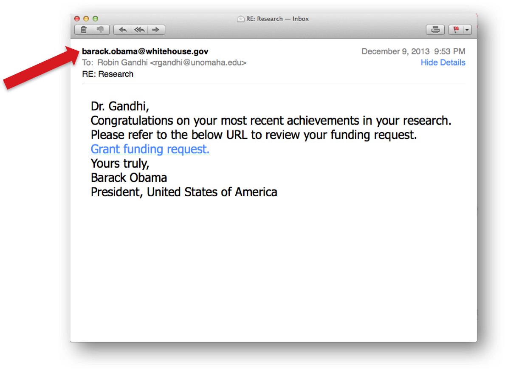

# Email Header Analysis

## Introduction (5 Mins)

Email is an indispensable communication tool. We use it everyday. Unfortunately many attacks also originate in emails. Wouldn't it be great if everyone had some mad email ninja skills! Don't worry, you will feel pretty good about your email analysis skills at the end of this session.

When reading emails, the first item that grabs our attention is the sender's name, email and subject. But, it may come as a surprise that spoofing these in a email is a pretty easy thing! It is also very effective at fooling unsuspecting email users. Take a look at some of the statistics in the [Verizon Data Breach Reports](http://www.verizonenterprise.com/verizon-insights-lab/dbir/).

Here is an interesting one:

> How long does an attacker have to wait to get that foot in the door? We aggregated the results of over 150,000 e-mails sent as part of sanctioned tests by two of our security awareness partners and measured how much time had passed from when the message was sent to when the recipient opened it, and if they were influenced to click or provide data (where the real damage is done). The data showed that nearly 50% of users open e-mails and click on phishing links within the first hour. [Verizon DBIR 2014]
> 
>
>> It did not get any better in 2016: _**13%** of people tested click on a phishing attachment; median time to click is very short._

If you are a bad guy planning a heist, that is the easiest way for getting malware into an organization. So it is prudent to understand exactly where an email is “really” coming from before opening attachments or clicking links in it. By the end of this unit you be able to do just that.

## Email Headers

Email Headers hold a lot of information. In fact they have so much information that they are never fully displayed to the user! The email reader only sees a select few pieces of information.

Before we get started, consider this email from President Barack Obama to a Researcher at the University of Nebraska at Omaha. They really do have a great Cyber security program. [Check it out!](http://www.unomaha.edu/college-of-information-science-and-technology/academics/information-assurance.php).

Anyways...we see emails like this all the time using desktop or web-based email clients. The section pointed to by the big red arrow, is the part of the email header that most people are familiar with.

There is more to this header.
